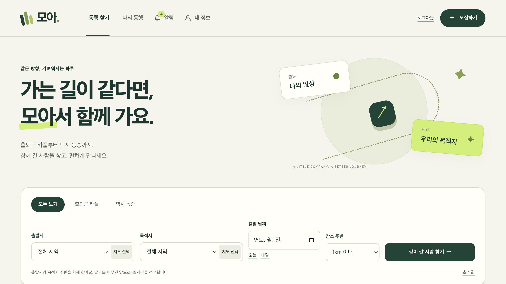
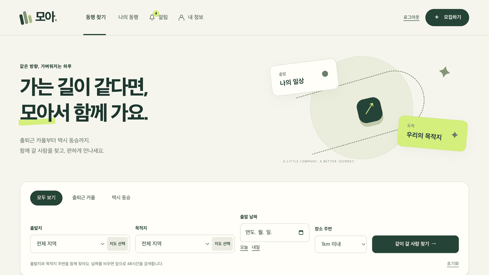
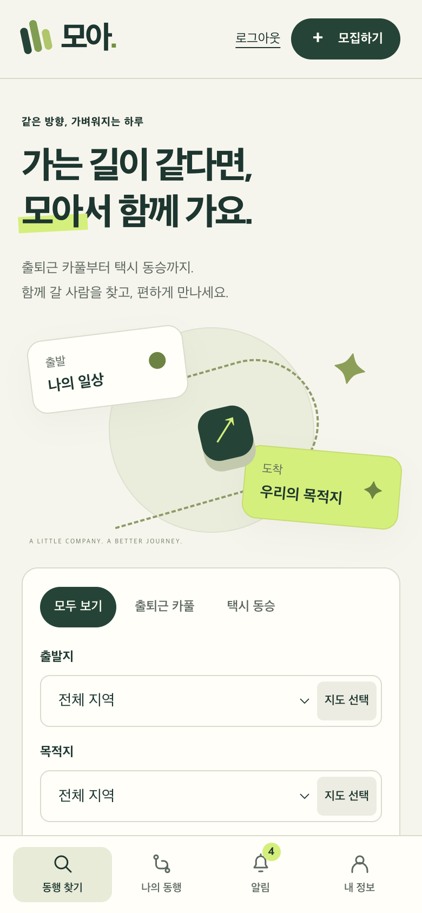
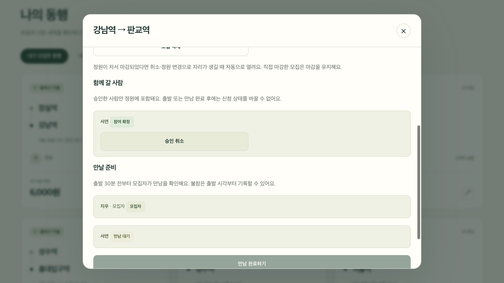
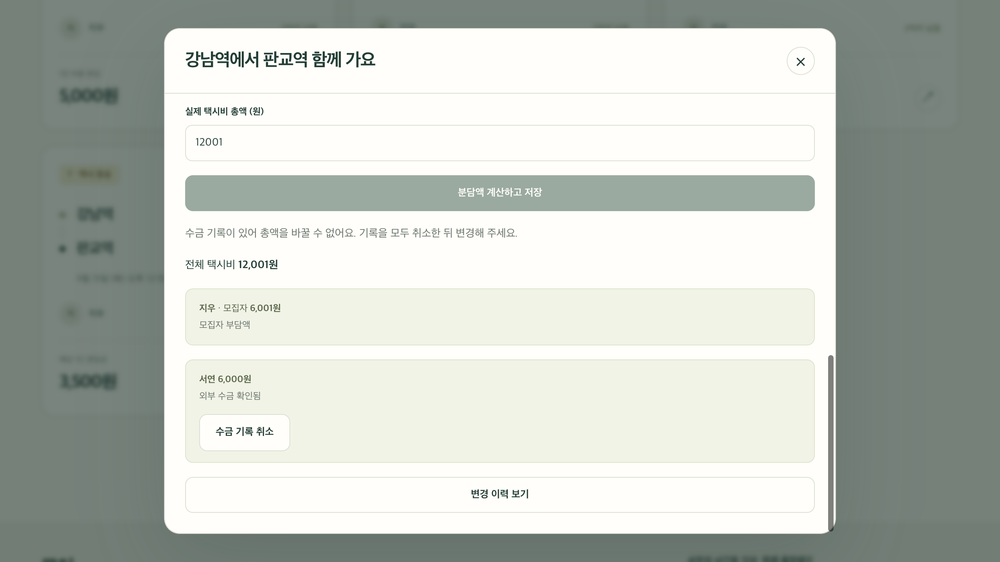
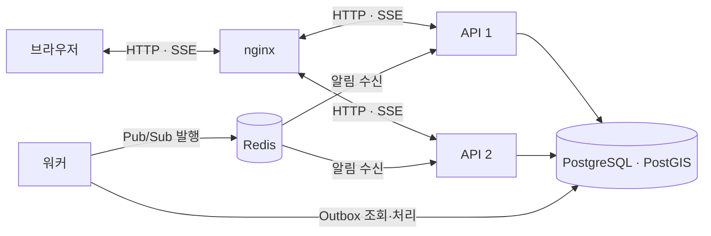

<div align="center">

# 🌿 모아

### 가는 길이 같다면, 모아서 함께 가요.

출퇴근 카풀과 택시 동승을 **검색 → 신청·승인 → 만남**으로 연결합니다.

[백엔드 코드](https://github.com/techeer-2026-teamC/carpool) · [프론트엔드 코드](https://github.com/techeer-2026-teamC/carpool-front/tree/pr/moa-front-12-docs) · [기술 문서](https://www.notion.so/3dc226545d1581feae7fe91dbd0c68dd) · [부하 테스트 계획](https://www.notion.so/3dc226545d1581ddbd30ff7479185476)




</div>

## 🧭 어떤 서비스인가요?

비슷한 시간에 같은 방향으로 이동하는 사람을 찾아, 모집자의 승인으로 동행을 확정합니다.
택시 동승은 실제 탑승자끼리 외부에서 지불한 비용을 나누고 수금 여부를 기록합니다.

| 단계 | 사용자에게 제공하는 기능 |
| --- | --- |
| 🔎 동행 찾기 | `CARPOOL`·`TAXI` 구분, 출발지와 목적지 주변 반경·날짜 검색, 출발 시각순 더보기 |
| 🙋 신청과 승인 | 모집 등록·수정·마감, 참여 신청·취소, 모집자의 승인·거절, 남은 정원 확인 |
| 🔔 변화 확인 | SSE 실시간 알림, 미확인 배지, 읽음 처리, 알림에서 동행 상세 열기 |
| 🤝 만나서 출발 | 출발 30분 전부터 만남 확인, 출발 시각부터 불참 기록, 참가자 상태 확정 후 만남 완료 |
| 🧾 택시 비용 나누기 | 만남 완료 후 실제 탑승자 분담금 계산, 외부 수금 확인·취소, 변경 이력 |
| 📍 필요한 순간의 위치 | 동의한 참가자만 만남 전후에 공유하는 독립 보조 모듈. STOMP를 사용하며 조회 범위와 보관 시간을 제한 |

택시 호출·결제·송금은 제공하지 않습니다. 카풀 모집에는 운전자 등록과 평일 출퇴근 시간 조건을 적용합니다.

### 🎬 주요 화면 둘러보기



*실제 검증 화면 4장을 순서대로 보여주는 15초 미리보기입니다. 연속 조작 녹화는 아닙니다.*

<details>
<summary><strong>📱 모바일 화면과 승인·분담 화면 더 보기</strong></summary>

<p align="center"></p>

| 신청 승인 | 택시 외부 비용 분담 |
| --- | --- |
|  |  |

</details>

## 🛠 깊게 다룬 기술 문제 3가지

### 1. SSE 연결 종료 후에도 남는 참조와 GC

연결이 끊겨도 서버의 보관소와 전송 큐에 참조가 남으면 관련 객체를 회수할 수 없습니다.
완료·타임아웃·전송 오류를 같은 종료 경로로 모으고, **해당 연결의 보관소 참조·대기 이벤트·연결 할당량을 한 번만 정리**합니다.
사용자별 여러 탭을 구분하며 연결 수와 전송 큐에 상한을 두고, 느린 수신자는 연결을 종료한 뒤 알림함에서 복구합니다.

> **이전 블로그 실험:** 앱별 약 2.47만 개의 종료 보관 세션과 강제 Full GC 후 약 269~270MiB를 관측했고, 수정 후 6분 비교에서는 보관 세션 0/0개와 GC 후 57/68MiB를 확인했습니다. [실험·해석 읽기](https://www.notion.so/3d6226545d1581669da5c41c680b77b5)

이 수치는 별도 과거 실험이며 이번 구현에서 재측정하지 않았습니다. 수정 후 짧은 비교에서는 힙 덤프를 수집하지 않았고, 자연 Full GC나 DAU 처리 성능의 개선을 의미하지 않습니다.

### 2. Redis 공유 캐시와 복구 가능한 실시간 알림

**공유 캐시의 범위를 정했습니다.** 예정 모집 목록은 Redis에 5분 TTL로 공유하고, 새 출발지·목적지 검색은 PostGIS의 공간 인덱스와 커서 쿼리로 처리합니다.
프로세스별 로컬 캐시는 별도 무효화 전파가 필요하므로 공유 저장소를 선택했습니다. 인덱스·쿼리 최적화가 부족했다고 측정한 결과는 아니며, 캐시 효율은 부하 테스트 계획에서 비교합니다.

**업무 변경과 알림 저장을 같은 DB 트랜잭션으로 묶었습니다.** 발행 대기 기록인 Outbox까지 함께 저장한 뒤, 별도 워커가 Redis Pub/Sub으로 전달하고 각 API가 자신의 SSE 연결로 보냅니다.

<details>
<summary><strong>왜 Redis인가요? 실패하면 어떻게 복구하나요?</strong></summary>

- **공간 검색:** Redis GEO도 반경 검색을 지원하지만, 모집 상태·시간·잔여 정원과 출발지·목적지 조건을 함께 다루는 기준 데이터는 PostgreSQL/PostGIS에 둡니다.
- **캐시 최신성과 장애:** 조회 오류는 DB로 돌아갑니다. 모집 변경 뒤 캐시를 무효화하지만 승인·취소 반영이나 무효화 실패로 목록이 TTL 동안 오래될 수 있습니다. 승인·좌석 판단은 DB를 사용합니다.
- **발행 장애:** 워커가 짧은 DB 트랜잭션으로 작업을 선점하고 락을 해제한 뒤 Redis를 호출합니다. 임대 만료로 중단된 작업을 회수하고 지수 지연으로 재시도합니다.
- **중복·누락:** 발행 직후 워커가 중단되면 같은 알림이 다시 올 수 있어 `notificationId`로 중복을 제거합니다. Pub/Sub 자체는 재생을 보장하지 않습니다.
- **브라우저 복구:** 초기 진입·재연결·탭 복귀·활성 탭의 30초 주기 DB 조회로 놓친 알림과 미확인 수를 보정합니다.
- **인프라 선택:** 현재 범위는 관계형 데이터의 정합성과 알림함 복구가 중심입니다. Kafka·별도 NoSQL은 도입하지 않았으며, 장기 이벤트 재생이나 독립 소비자의 요구가 생기면 다시 평가합니다.

</details>

### 3. 여러 API에서 마지막 한 자리를 동시에 승인하면?

같은 모집의 변경을 **PostgreSQL 비관적 행 락**으로 직렬화합니다.
승인 상태·인원 증가·알림·Outbox를 한 트랜잭션에 반영하며, 회원 탈퇴와의 경합은 회원 → 모집 순서의 잠금으로 제어합니다.
API 프로세스가 여러 개여도 같은 DB 행에서 조정되므로, 정원의 기준인 DB 외에 Redis 분산 락을 추가할 필요가 없습니다.

<details>
<summary><strong>비관적 락·낙관적 락·조건부 UPDATE·분산 락 비교</strong></summary>

| 방식 | 장점 | 이 기능에서 고려한 점 |
| --- | --- | --- |
| **DB 비관적 락 — 채택** | 잠근 모집을 기준으로 상태와 정원을 함께 검사·변경 | 인기 모집에서는 대기 발생. 트랜잭션 범위와 잠금 순서 관리 필요 |
| 낙관적 락 | 충돌이 적을 때 대기 없이 진행 | 마지막 좌석에 요청이 몰리면 충돌·재시도 비용 검증 필요 |
| 조건부 UPDATE | 잔여 정원 조건을 원자적으로 검사·증가 | 좋은 대안이지만 승인·취소·재승인·마감의 상태 전이까지 같은 규칙으로 묶어야 함 |
| Redis 분산 락 | DB 밖의 여러 자원에 걸친 작업 조정 가능 | 임대 만료·해제 소유권·장애 복구와 DB 커밋의 관계를 추가로 다뤄야 함 |

현재 선택은 기능 정합성과 구현 복잡도에 근거합니다. 네 방식의 처리량·지연 우열은 아직 측정하지 않았습니다.
[정원·분산 락 설계 문서](https://www.notion.so/3dc226545d1581bba794f3df8255c9ba)

</details>

## 🧱 프로세스 구성과 관측

**API 2개 + 워커 1개**, 공유 PostgreSQL/PostGIS·Redis, 앞단 nginx로 구성했습니다.
API는 요청과 실시간 연결을 처리하고, 워커는 Outbox 발행과 모집 예약 작업을 맡습니다.
알림 SSE와 만남 위치 STOMP는 서로 다른 모듈로 분리했습니다.



Prometheus·Grafana에서 요청률·p95·오류, SSE 연결 수, Outbox 대기·재시도·최장 지연, DB 연결, Redis 메모리와 GC를 관측합니다.
**DAU 10만과 출퇴근 집중 트래픽은 설계 가정**입니다. 현재 로컬 구성의 처리 용량이나 운영 고가용성을 검증한 수치가 아닙니다.

## ✅ 확인한 것과 다음 검증

| 항목 | 확인 범위 |
| --- | --- |
| 백엔드 | 기능 테스트 **159개 통과**, 실제 PostgreSQL/PostGIS·Redis 통합 검증 포함 |
| 분산 실행 | API 2개·워커 1개 기동, 서로 다른 API의 SSE 연결에서 같은 알림 ID 수신 |
| 관측 환경 | Prometheus **6개 타깃 UP**, Grafana 정상 응답과 **10개 패널** 구성 |
| 프론트엔드 | Node 22 테스트 **40개 통과**, Vite 프로덕션 빌드 성공 |
| 실제 브라우저 | 등록·검색·신청·모집자 승인·정원 반영, SSE 수신·읽음, 만남 완료·택시 분담, 모바일 화면 |
| 위치 보조 기능 | 가짜 좌표의 공유·중지 확인. 실기기 GPS 이동·권한 팝업은 미검증 |
| 이번 부하 테스트 | **실행하지 않음.** 시나리오·관측 지표·비교 기준을 [Notion 계획](https://www.notion.so/3dc226545d1581ddbd30ff7479185476)에 정리 |

<details>
<summary><strong>코드 반영·CI 상태 · 2026-09-15 기준</strong></summary>

- **백엔드:** 16개 PR이 `main`에 병합됐습니다. 검증한 코드와 최종 `4c6d1a9`의 트리가 같고, [해당 main의 GitHub CI](https://github.com/techeer-2026-teamC/carpool/actions/runs/34928324351)가 성공했습니다. 배포 작업은 실행하지 않았습니다.
- **프론트엔드:** [PR #8–#19](https://github.com/techeer-2026-teamC/carpool-front/pulls)는 리뷰 가능한 상태이며 아직 병합하지 않았습니다. 아래 실행 안내는 누적 구현이 있는 `pr/moa-front-12-docs` 브랜치를 사용합니다.
- **프론트 원격 CI:** workflow와 로컬 검증은 준비됐지만 GitHub 실행이 생성되지 않는 원인은 아직 확정하지 못했습니다. 원격 CI 통과로 표기하지 않습니다.
- 테스트 계정과 일부 신청 데이터는 로컬 API로 준비했습니다. 기능 테스트·화면 검증과 부하 측정은 구분합니다.

</details>

## 🚀 직접 실행하고 코드 읽기

Docker Compose와 Node.js 22를 준비합니다. 백엔드 테스트를 직접 실행하려면 JDK 17도 필요합니다.

```bash
git clone https://github.com/techeer-2026-teamC/carpool.git moa-backend
cd moa-backend
docker compose -f docker-compose.moa.yml --profile monitoring up -d --build
```

다른 터미널에서 프론트엔드를 실행합니다.

```bash
git clone --branch pr/moa-front-12-docs https://github.com/techeer-2026-teamC/carpool-front.git moa-front
cd moa-front
npm ci
npm test
npm run dev
```

화면은 `localhost:5173`, API는 `localhost:18080`, Prometheus는 `localhost:19090`, Grafana는 `localhost:13000`입니다.
새 UI는 Leaflet·OpenStreetMap을 사용해 필수 지도 API 키가 없습니다. 구형 `npm run mock`은 신규 모아 통합 검증에 사용하지 않습니다.

| 더 알아보기 | 내용 |
| --- | --- |
| [백엔드 로컬 실행](https://github.com/techeer-2026-teamC/carpool/blob/main/docs/moa-local.md) | 프로세스·DB·Redis·관측 환경과 테스트 실행 |
| [프론트엔드 안내](https://github.com/techeer-2026-teamC/carpool-front/blob/pr/moa-front-12-docs/README.md) | 화면별 모듈 역할, 실행 방법, 검증 범위 |
| [Notion 기술 문서](https://www.notion.so/3dc226545d1581feae7fe91dbd0c68dd) | 서비스 범위와 설계 결정, 관련 문서 탐색 |
| [부하 테스트 계획](https://www.notion.so/3dc226545d1581ddbd30ff7479185476) | 출퇴근 집중·정원 경합·알림 복구·캐시 비교 시나리오 |

---

<p align="center"><strong>Techeer 2026 Team-C · 모아</strong><br/>함께 갈 사람을 찾는 경험과, 그 과정을 지키는 서버를 만듭니다.</p>
